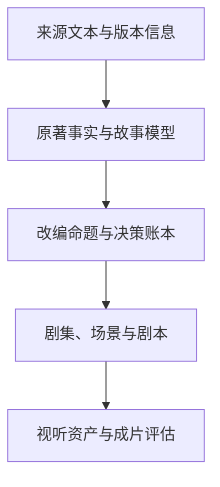

# Classic-to-Drama Engine：项目总览

> 文档状态：Phase 0 / Foundation v0.1  
> 首个实验项目：《荷马史诗·奥德赛》  
> 当前边界：建立方法、数据与工作流；暂不生成分集剧情和剧本正文。

## 1. 项目定位

Classic-to-Drama Engine 是一套面向经典文学改编的开源 AI 工作流。它的目标不是让模型“一次性把名著改成短剧”，而是把文学改编拆成一组可复核、可替换、可重复执行的工程步骤：整理文本证据，建立故事模型，形成改编决策，规划剧集，生成剧本，再衔接视听制作。

项目同时服务三类目标：

- **文学目标**：识别并保留原作的叙事骨架、人物关系、核心主题和标志性意象。
- **戏剧目标**：把长篇、史诗、章回体或舞台文本转化为适合现代短剧观看节奏的冲突、行动、反转与悬念。
- **工程目标**：让每一项分析和改编选择都有结构化产物、来源引用、版本状态和人工审核记录。

这不是一个单独的《奥德赛》改写项目，而是一个以《奥德赛》为首个压力测试的通用“经典文本改编引擎”。

## 2. Phase 0 的目标与边界

Phase 0 只负责确定项目的基础契约：

1. 项目为何存在，以及开源后要解决什么问题。
2. 经典文学转化为现代短剧的基本方法。
3. 原著事实、分析结论、改编决策、剧集与制作资产如何组织。
4. 从文本进入到视频制作的阶段、依赖和审核门槛。
5. 各类 Agent 的职责、输入、输出和交接规则。

Phase 0 **不包含**：

- 《奥德赛》的正式分季或分集方案；
- 任何一集的完整剧本、对白或分镜；
- 人物视觉定稿、配音、视频生成或成片；
- 未经来源核验的“原著事实”。

Phase 0 的三份基础文档是：

- [01_PROJECT_OVERVIEW.md](01_PROJECT_OVERVIEW.md)：定位、目标、首作策略、数据模型与 Agent 架构。
- [02_ADAPTATION_METHOD.md](02_ADAPTATION_METHOD.md)：从经典文本到短剧的改编方法与质量边界。
- [03_WORKFLOW.md](03_WORKFLOW.md)：端到端生产流程、阶段产物与审核门槛。

## 3. 《奥德赛》首个实验的改编策略

### 3.1 为什么选择《奥德赛》

《奥德赛》同时具备三种结构，适合验证通用改编流程：

- **连续主线**：奥德修斯返乡、恢复身份并重建家庭秩序。
- **模块冒险**：独眼巨人、喀耳刻、塞壬、冥府等段落可独立形成戏剧单元。
- **多线并进**：奥德修斯的漂泊、忒勒马科斯的成长、佩涅洛佩与求婚者的对峙彼此牵引。

它也暴露了经典改编最典型的难题：篇幅巨大、口述传统形成的重复、神祇干预、非线性回忆、古代伦理与现代观众距离，以及著名桥段容易压过完整人物弧光。

### 3.2 初始改编命题

本项目将《奥德赛》的核心理解为：**一个擅长隐藏身份和操纵叙事的人，必须穿越诱惑、创伤与自己造成的后果，才能重新被家人识别，并证明“回家”不等于“恢复原样”。**

这个命题用于统摄后续取舍，但不替代原著分析。正式改编命题必须在完成文本证据包后再次审核。

### 3.3 默认创作方向

- **世界设定**：默认保留古希腊神话世界，不先做现代都市换皮。
- **现代化对象**：现代化叙事节奏、情绪可读性、对白功能和视听表达，而不是抹去时代差异。
- **叙事结构**：优先采用“伊萨卡危机 + 海上归途”双线推进，让家园压力成为持续倒计时。
- **人物中心**：奥德修斯是主行动线；佩涅洛佩与忒勒马科斯拥有独立目标和选择，不只充当等待者。
- **神祇处理**：保留神祇作为真实行动力量，同时把其干预落实为人物必须支付的具体代价。
- **冒险取舍**：按因果、人物变化、主题价值、辨识度和影像潜力筛选；不以“名场面清单”代替完整故事。
- **短剧机制**：每集应完成一个可识别的行动变化，并留下由前因产生的悬念；不依赖与人物逻辑无关的强行反转。

### 3.4 不可轻易破坏的叙事脊柱

下列内容暂定为首轮改编的“核心脊柱”，后续只有通过人工审核的改编决策才能调整：

1. 特洛伊战争结束后，奥德修斯长期不能归乡。
2. 伊萨卡的权力与家庭秩序在其缺席中遭到侵蚀。
3. 漂泊中的选择既显示奥德修斯的机智，也不断暴露其骄傲、控制欲和代价。
4. 佩涅洛佩以自己的智慧延缓被迫改嫁，忒勒马科斯则从被动走向行动。
5. 返乡不是终点；隐藏、试探、识别与复仇共同构成“重新取得身份”的过程。
6. 夫妻重逢必须通过只有双方共享的记忆与判断完成，而不是靠简单宣告。

## 4. 开源目标

### 4.1 可复用

把与作品无关的通用能力沉淀为模板、数据模式、提示词、评估规则和 Agent 契约；把《奥德赛》专属内容放在独立项目目录中。

### 4.2 可追溯

任何事实性陈述都能回到具体版本和文本位置；任何偏离、合并、删减、重排或新增都能回到一条明确的改编决策记录。

### 4.3 可协作

让文学研究者、编剧、AI 开发者和视频创作者可以分别贡献文本校订、人物分析、剧集规划、评价规则或制作适配器，而不必重做整条流水线。

### 4.4 可评估

把“像不像原作”“好不好看”“能不能拍”分解成可检查的指标，并保留人工评审作为创意决策的最终门槛。

### 4.5 模型与工具中立

核心数据不绑定某一个大模型、视频平台或编剧软件。模型调用、检索方式、剧本格式和视频生成工具应以适配器接入。

## 5. 未来支持的作品

项目将优先选择已经形成公共文化认知、又能代表不同叙事难题的经典作品。

| 测试类型 | 候选作品 | 用于验证的能力 |
| --- | --- | --- |
| 史诗与神话 | 《伊利亚特》《埃涅阿斯纪》《神曲》 | 大规模人物、神话系统、旅程与战争结构 |
| 中国章回小说 | 《西游记》《三国演义》《水浒传》《红楼梦》 | 多线人物、长周期弧光、章节模块化与文化语境 |
| 戏剧 | 莎士比亚悲剧、古希腊悲剧 | 场景压缩、对白转译、舞台行动到镜头行动 |
| 小说 | 《傲慢与偏见》《基督山伯爵》《双城记》 | 内心叙事、社会关系、悬念与长线复仇 |
| 故事集 | 《一千零一夜》《聊斋志异》 | 单元剧、框架叙事、选篇与统一世界观 |

新增作品不以“能否直接套同一模板”为标准，而以能否暴露并修正工作流盲区为标准。

## 6. AI 辅助改编的总体流程

AI 主要承担高容量、可重复的工作：文本切分、实体与事件抽取、关系整理、候选方案生成、一致性检查、格式转换和版本比较。人类主要负责价值判断：选择改编命题、批准重大偏离、决定人物解释、判断戏剧效果并锁定最终版本。

流水线遵循四条规则：

1. **先证据，后解释，再改编。**
2. **上游未审核，下游不锁定。**
3. **生成与评审分离。** 同一 Agent 不应独自完成创作并宣布通过。
4. **结构化产物优先。** 长篇自然语言报告不能替代可检索的角色、事件、关系和决策记录。

## 7. 数据结构设计

### 7.1 五层数据模型

| 层级 | 内容 | 典型产物 | 核心约束 |
| --- | --- | --- | --- |
| L0 来源层 | 原文、译本、版本元数据、段落定位 | `source_manifest`、规范化文本、段落索引 | 不改写来源内容；位置可引用 |
| L1 故事事实层 | 人物、关系、事件、地点、物件、母题 | `characters`、`events`、`story_facts` | 事实与解释分开；必须带来源引用 |
| L2 改编设计层 | 核心命题、保留策略、合并/删改、新增、叙事顺序 | `adaptation_brief`、`decision_log`、`story_map` | 每项偏离说明理由、影响和审批状态 |
| L3 剧本生产层 | 季/集/场规划、剧本、连续性记录 | `season_plan`、`episode_cards`、`scenes`、`scripts` | 只消费已批准的 L1/L2 数据 |
| L4 视听生产层 | 角色视觉、场景、镜头、声音、成片与反馈 | `asset_manifest`、`shot_plan`、`render_log`、`evaluations` | 资产身份稳定；镜头可回溯到场景 |

### 7.2 核心实体

| 实体 | 作用 | 必备字段示例 |
| --- | --- | --- |
| `SourcePassage` | 可定位的原文片段 | `source_id`、`passage_id`、`locator`、`text` |
| `StoryFact` | 从文本确认的最小事实 | `fact_id`、`statement`、`source_refs`、`confidence` |
| `Character` | 人物身份与弧光 | `character_id`、`names`、`goals`、`traits_evidence`、`relationships` |
| `Event` | 有因果和状态变化的事件 | `event_id`、`participants`、`preconditions`、`action`、`outcome`、`source_refs` |
| `Motif` | 反复出现的主题或意象 | `motif_id`、`meaning_candidates`、`occurrences` |
| `AdaptationDecision` | 记录所有重要改动 | `decision_id`、`operation`、`source_refs`、`rationale`、`impact`、`status` |
| `EpisodeCard` | 单集的结构化规划 | `episode_id`、`goal`、`conflict`、`turn`、`cliffhanger`、`event_refs` |
| `Scene` | 可拍摄的戏剧行动单元 | `scene_id`、`location`、`time`、`characters`、`objective`、`outcome` |
| `Asset` | 生产阶段的角色、场景、声音或镜头资产 | `asset_id`、`type`、`prompt_or_source`、`version`、`scene_refs` |
| `QARecord` | 审核与评估结果 | `qa_id`、`target_id`、`checklist`、`findings`、`reviewer`、`status` |

### 7.3 所有关键记录的公共字段

结构化记录至少应包含：

- 稳定 ID；
- 所属作品与版本；
- 来源引用或上游对象引用；
- `draft / reviewed / approved / locked / rejected / blocked` 状态；
- 创建者（人或 Agent）、时间和使用的流程版本；
- 置信度或不确定性说明；
- 变更原因与版本号。

**事实、推断和创作新增必须使用不同字段或不同记录类型。** 例如，“奥德修斯隐瞒身份”可以是文本事实；“因为创伤而不敢回归亲密关系”只能先标为人物解释；为短剧新增的秘密交易则必须标为创作新增。

### 7.4 建议的仓库结构

| 路径 | 用途 |
| --- | --- |
| `/docs/` | 通用方法、工作流、贡献规范与术语 |
| `/schemas/` | JSON Schema / YAML Schema 与 ID 规则 |
| `/agents/` | Agent 职责、输入输出契约与提示词 |
| `/prompts/` | 可版本化、可测试的任务提示模板 |
| `/evals/` | 忠实性、连续性、戏剧性和可制作性评测 |
| `/adapters/` | 模型、剧本格式、视频与音频工具适配器 |
| `/projects/odyssey/sources/` | 《奥德赛》版本清单、规范化文本与索引 |
| `/projects/odyssey/analysis/` | 事实、人物、事件、关系、主题分析 |
| `/projects/odyssey/adaptation/` | 改编简报、决策账本、故事映射与剧集规划 |
| `/projects/odyssey/scripts/` | 后续阶段批准的剧本版本 |
| `/projects/odyssey/production/` | 视听资产与制作记录 |
| `/projects/odyssey/qa/` | 审核报告、问题清单与回归结果 |

## 8. Agent 分工与交接

| Agent | 主要职责 | 主要输出 | 不得自行决定 |
| --- | --- | --- | --- |
| Orchestrator | 调度阶段、检查依赖、维护状态 | 运行记录、任务清单、版本快照 | 不替代内容审核 |
| Source Curator | 版本选择、文本清洗、段落索引 | 来源清单、规范化文本、索引 | 不把摘要当原文证据 |
| Text Analyst | 抽取事实、事件、地点、物件与母题 | 故事事实库、事件表、主题候选 | 不生成改编情节 |
| Character Analyst | 建立人物目标、关系、变化和证据 | 人物档案、关系图、人物弧候选 | 不把心理推断标成事实 |
| Dramaturg | 分析因果链、冲突、揭示与戏剧潜力 | 戏剧结构图、关键节点 | 不直接批准删改原著 |
| Adaptation Architect | 提出改编命题与取舍方案 | 改编简报、决策账本、故事映射 | 不绕过人工批准重大偏离 |
| Episode Planner | 把已批准故事映射为季、集、场 | 季规划、单集卡、悬念链 | 不擅自新增未登记主线 |
| Screenwriter | 按单集卡生成剧本版本 | 场景与剧本草稿 | 不改动锁定的人物和结局契约 |
| Continuity Editor | 检查时间、知识、道具、关系和伏笔 | 连续性报告、修订建议 | 不同时担任唯一终审者 |
| Production Designer | 将剧本转换为可制作的视听规范 | 角色/场景/镜头/声音资产清单 | 不以工具限制悄悄改变剧情 |
| QA Evaluator | 独立评估忠实性、戏剧性和可制作性 | 评分、阻断项、回归报告 | 不把自动评分当最终艺术判断 |

交接采用“产物 + 状态”而不是口头上下文。下游 Agent 只能把 `approved` 或 `locked` 的上游产物视为约束；`draft` 内容只能作为候选。

## 9. 人类保留的关键决策权

以下节点必须由项目负责人明确批准：

- 使用哪个文本版本和哪些辅助译本；
- 目标观众、平台、画幅、单集时长与总集数范围；
- 采用古代世界设定还是整体移植到现代；
- 核心改编命题、主人公结构和结局边界；
- 合并主要人物、改变关键因果、改写重大伦理后果；
- 季规划锁定、剧本定稿和成片发布。

## 10. Phase 0 完成标准

当以下条件同时满足，项目可以进入 Phase 1“来源文本与证据包”：

- 三份基础文档已创建且术语一致；
- 已明确《奥德赛》首作的默认策略与暂不决定项；
- 已定义五层数据模型、核心实体和状态规则；
- 已定义端到端工作流、Agent 分工与人工审核点；
- 文档中没有分集正文或伪装成原著事实的生成内容。

下一阶段应先确定《奥德赛》的底本、译本和文本定位方案，再开始人物或剧集分析。
