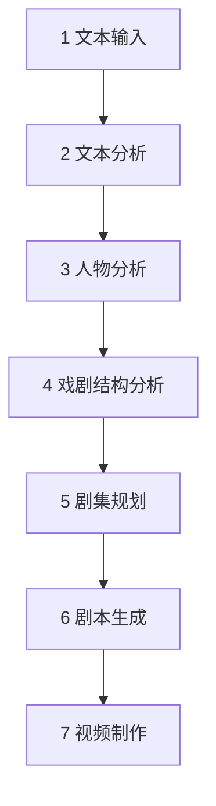

# Classic-to-Drama Engine：端到端工作流

> 文档状态：Phase 0 / Workflow v0.1  
> 范围：从文本输入到视频制作的完整流水线  
> 当前执行点：只定义流程，不生成《奥德赛》剧本。

## 1. 工作流目标

本工作流把经典改编拆成七个主要生产阶段和一组横向质量机制。每个阶段都有明确输入、处理、结构化输出、人工审核点与完成条件。下游不依靠聊天记录猜测上游结论，而只读取已保存并标记状态的产物。

质量评估、连续性检查、改编决策记录和人工审核贯穿所有阶段。

## 2. 全局运行规则

### 2.1 状态机

所有关键产物使用统一状态：

| 状态 | 含义 | 是否可作为下游锁定依据 |
| --- | --- | --- |
| `draft` | Agent 或人类生成的初稿 | 否 |
| `reviewed` | 已经过独立检查，仍可修改 | 否，仅可用于候选比较 |
| `approved` | 已获负责人批准，可进入下一阶段 | 是 |
| `locked` | 当前生产版本的稳定约束 | 是，修改需新版本和变更记录 |
| `rejected` | 已否决，保留用于审计 | 否 |
| `blocked` | 缺少输入、证据或决策 | 否 |

### 2.2 阶段门槛

每阶段必须满足四个条件才能通过：

1. 必备输入存在，版本明确；
2. 必备输出通过模式校验；
3. 独立评审没有未解决的阻断项；
4. 需要创意判断的部分已由人类批准。

### 2.3 可追溯性

追溯链必须能够从成片逐层返回：

`镜头 → 场景 → 单集卡 → 改编决策/故事事件 → 原文段落`

创作新增没有原文段落时，必须返回一条 `INVENT` 改编决策及其理由，而不是伪造来源引用。

### 2.4 生成与评审分离

同一模型可以在不同运行中承担不同角色，但生成任务与最终评审任务必须使用不同上下文和明确的评审契约。高影响变更还需要人工批准。

## 3. Stage 1：文本输入

### 3.1 目标

建立可引用、可复现的来源文本包，为所有“原著中是否如此”的判断提供唯一证据入口。

### 3.2 原文本是否必要

正式流水线需要至少一份完整、可定位的原文或工作底本。梗概、百科和二手评论可以用于早期试验或发现问题，但不能替代事实层证据。

《奥德赛》建议准备：

- 一份确定为主工作底本的完整文本；
- 必要时加入古希腊原文或可靠的行号对照，用于处理译文差异；
- 一至两份辅助译本，用来比较专名、语气和歧义；
- 卷、行、页或段落等稳定定位信息；
- 版本元数据与文本处理记录。

### 3.3 输入

- 原文/译文文件；
- 书目信息与版本说明；
- 已知章节、卷次或行号结构；
- 项目语言与目标输出语言；
- 允许使用的研究资料清单。

### 3.4 处理

1. 记录来源身份与版本。
2. 提取文本并统一编码、换行和章节边界。
3. 保留原始文件，生成规范化工作副本。
4. 按卷、段或语义单元切分，分配稳定 `passage_id`。
5. 建立原始位置与规范化片段之间的映射。
6. 抽样检查缺页、乱码、错序、OCR 噪声和重复。

### 3.5 输出

- `source_manifest`：来源、版本、语言、文件身份；
- `normalized_text`：规范化文本；
- `passage_index`：稳定片段 ID 与定位；
- `source_quality_report`：完整性和已知问题；
- `term_map`：专名、异名与译名候选。

### 3.6 Gate S1：来源就绪

- 主底本完整且可以稳定定位；
- 所有规范化片段能返回原始位置；
- 文本缺陷已修复或明确标注；
- 负责人批准主底本与辅助文本的用途。

## 4. Stage 2：文本分析

### 4.1 目标

把长文本转化为来源可追踪的故事事实、事件、地点、物件、母题和时间信息，不在此阶段做短剧改写。

### 4.2 处理

1. 逐片段抽取人物出场、行动、陈述和结果。
2. 将复述同一事件的不同片段关联起来。
3. 区分当前发生、回忆、自述、预言、传闻和嵌套故事。
4. 建立事件的前置条件、行动、结果和后果。
5. 抽取地点、道具、身份标记、礼仪和反复意象。
6. 标记事实、推断、矛盾和文本歧义。
7. 生成待人工复核的问题，而不是强行消除不确定性。

### 4.3 输出

- `story_facts.jsonl`；
- `events.jsonl`；
- `locations.yaml`；
- `objects_and_motifs.yaml`；
- `timeline_candidates.yaml`；
- `ambiguities.md`；
- 来源覆盖率与抽取质量报告。

### 4.4 Gate S2：故事事实就绪

- 核心事件均有来源引用；
- 当前事件与回忆/预言等叙述层次已区分；
- 矛盾信息没有被模型静默合并；
- 独立抽样复核达到项目设定的准确率门槛。

## 5. Stage 3：人物分析

### 5.1 目标

建立可用于戏剧行动的人物模型，同时保留“文本证据”和“心理解释”之间的边界。

### 5.2 每个人物至少分析

- 身份、称谓、阵营与出场范围；
- 明确目标和阶段性目标；
- 能力、资源与行动策略；
- 恐惧、欲望、缺陷与矛盾，但需标注证据强度；
- 与其他人物的权力、情感、承诺和秘密关系；
- 每个阶段知道什么、不知道什么；
- 关键选择、代价和状态变化；
- 可合并、可压缩或必须保留的叙事功能。

### 5.3 《奥德赛》的首轮重点人物

首轮不追求一次覆盖所有名字，先完成奥德修斯、佩涅洛佩、忒勒马科斯、雅典娜、波塞冬及伊萨卡求婚者群体等核心节点，再按事件依赖扩展船员、神祇、盟友与识别人物。

### 5.4 输出

- `characters.yaml`；
- `relationships.yaml`；
- `character_knowledge_states.jsonl`；
- `character_arc_candidates.yaml`；
- `merge_candidates.yaml`；
- 人物证据与一致性审核报告。

### 5.5 Gate S3：人物模型就绪

- 主要人物的目标、策略和变化都能关联到事件证据；
- 推断性动机已明确标注；
- 关系图与事件参与者一致；
- 合并人物的提议尚未回写事实层；
- 人工批准主要人物的解释边界。

## 6. Stage 4：戏剧结构分析

### 6.1 目标

从“发生过什么”转向“为什么观众要继续看”，识别主因果链、冲突升级、揭示顺序、人物代价和可改编模块。

### 6.2 处理

1. 写出作品的核心承诺和主题对立候选。
2. 识别开端状态、触发、升级、重大转折、危机、高潮与余波。
3. 区分故事实际时间与原作讲述顺序。
4. 标出每条人物线的目标、阻力、选择和代价。
5. 识别可作为单集核心的行动单元，而不是直接按章节切集。
6. 对事件进行保留价值与制作复杂度评分。
7. 生成多个改编结构候选，并明确各自牺牲什么。

### 6.3 输出

- `narrative_dna.yaml`；
- `causal_graph`；
- `dramatic_beats.yaml`；
- `story_vs_telling_order.yaml`；
- `module_scores.csv`；
- `adaptation_options.md`；
- `adaptation_brief.yaml`；
- `decision_log.yaml`。

### 6.4 人工审核点 H1：改编方向

负责人在此锁定：

- 目标观众与内容尺度；
- 世界设定与现代化模式；
- 单集时长、总集数或季规模的目标范围；
- 核心命题、视角结构与主要人物弧；
- 不可轻易破坏的故事脊柱；
- 允许合并、重排、新增和改变的边界。

### 6.5 Gate S4：改编蓝图就绪

- 改编简报已 `approved`；
- 每个重大偏离都有决策记录；
- 主因果链没有未解释断点；
- 创作方向在忠实性、短剧性与制作条件之间形成明确取舍。

## 7. Stage 5：剧集规划

### 7.1 目标

把批准的改编蓝图映射为季、集、场的结构，不在规划过程中擅自重写上游契约。

### 7.2 处理顺序

1. 确定整季开场承诺、主中点、危机、高潮和收束。
2. 把主因果链分配到各集，检查人物变化是否连续。
3. 建立 A/B/C 叙事线的交叉关系和每集权重。
4. 为每集创建结构卡：开场压力、目标、阻力、转折、代价、结尾悬念。
5. 把每集拆为场景卡，并限制新增地点、角色和高成本资产。
6. 建立伏笔—兑现表、角色知识表和道具连续性表。
7. 对连续观看进行“悬念债务”检查：提出的问题必须有计划兑现。

### 7.3 输出

- `season_plan.yaml`；
- `episode_map.yaml`；
- `/episode_cards/EP-xxx.yaml`；
- `scene_outline.yaml`；
- `setup_payoff_registry.yaml`；
- `continuity_bible.yaml`；
- `production_budget_assumptions.yaml`。

### 7.4 人工审核点 H2：剧集锁定

先批准整季结构，再生成任何完整剧本。重点确认：

- 每集是否发生不可撤回的状态变化；
- 悬念是否来自既有因果；
- 主要人物弧是否被切集节奏破坏；
- 是否为了名场面牺牲了返乡主线；
- 总角色、场景、特效与制作目标是否匹配。

### 7.5 Gate S5：剧本输入就绪

- 季规划与全部目标单集卡已 `approved`；
- 伏笔、知识状态和连续性约束完整；
- 所有新增主线已登记并批准；
- 没有未解决的结构阻断项。

## 8. Stage 6：剧本生成

### 8.1 目标

按照锁定的单集卡和连续性契约，生成可表演、可拍摄、可评审的剧本版本。

### 8.2 生成循环

每次只处理一集或一个有限场景组：

1. 组装当前单集所需的最小上下文包。
2. 先生成场景节拍，再生成对白和动作。
3. 运行结构、人物知识、来源边界和格式检查。
4. 由独立 Script Editor 提出问题，不直接宣布通过。
5. 编剧 Agent 按问题清单修订，并记录变更。
6. 人工锁定本集后，更新连续性圣经，再进入下一集。

### 8.3 剧本约束

- 每场都要有目标、阻力、策略和状态变化；
- 对白必须是行动的一部分，不用来朗读设定；
- 旁白的使用遵守已批准的整体叙事策略；
- 角色只能使用其当前知识状态中已有的信息；
- 任何越过单集卡的重大新增必须退回 Stage 4/5 登记；
- 生产标签不混入观众可见对白。

### 8.4 输出

- 标准化剧本文件；
- `scene_manifest`；
- 单集变更日志；
- 对白/动作/时长估算；
- 来源与改编决策追溯表；
- 连续性、人物一致性和制作可行性评审报告。

### 8.5 人工审核点 H3：剧本定稿

人工逐集确认戏剧效果、人物语气、文化表达、内容尺度和制作边界。自动评分只用于发现问题，不替代定稿判断。

### 8.6 Gate S6：制作脚本就绪

- 剧本状态为 `locked`；
- 所有场景存在于场景清单并有稳定 ID；
- 连续性与知识状态检查无阻断项；
- 重大改编均可追溯；
- 时长和制作复杂度符合目标范围。

## 9. Stage 7：视频制作

### 9.1 目标

把锁定剧本转换为可重复生成和组合的角色、场景、镜头、声音与字幕资产，最终形成成片。

### 9.2 生产步骤

1. **视觉圣经**：角色外观、服装阶段、色彩、场景、道具和母题规则。
2. **资产登记**：为角色、地点、道具、声音和模型分配稳定 ID 与版本。
3. **分镜与镜头规划**：把每场拆为镜头，标明景别、动作、时长、对白和资产引用。
4. **角色与场景生成**：先做一致性测试，再批量生成目标镜头。
5. **语音与声音**：角色音色、语气、环境、音乐和响度规则。
6. **剪辑与字幕**：按镜头清单组装，检查节奏、口型、字幕和跨镜连续性。
7. **成片 QA**：视觉身份、剧情可懂度、声音、字幕、时长和平台规格。
8. **反馈回流**：把观众或测试反馈映射到具体集、场、镜头或上游结构问题。

### 9.3 输出

- `visual_bible`；
- `asset_manifest`；
- `shot_list` 与分镜；
- 角色、场景、道具、语音和音乐资产；
- 渲染与剪辑记录；
- 字幕和发布文件；
- `video_qa_report` 与反馈数据。

### 9.4 Gate S7：发布候选就绪

- 关键角色跨镜头可识别；
- 镜头内容与锁定剧本一致，偏离已登记；
- 声音、字幕、画幅和时长符合目标平台规格；
- 没有影响理解的连续性错误；
- 人工完成最终观看和发布批准。

## 10. Agent 编排

### 10.1 推荐的执行关系

| 阶段 | 主执行 Agent | 独立评审 Agent | 人工角色 |
| --- | --- | --- | --- |
| 文本输入 | Source Curator | Source QA | 选择底本、确认缺陷处理 |
| 文本分析 | Text Analyst | Evidence Reviewer | 裁决歧义和关键事实 |
| 人物分析 | Character Analyst | Character Consistency Reviewer | 批准主要人物解释 |
| 戏剧结构 | Dramaturg + Adaptation Architect | Canon/Structure Reviewer | 锁定改编命题和边界 |
| 剧集规划 | Episode Planner | Continuity Editor | 批准季规划与单集卡 |
| 剧本生成 | Screenwriter | Script Editor + Continuity Editor | 逐集定稿 |
| 视频制作 | Production Designer + Video Agents | Audiovisual QA | 最终观看与发布决定 |

### 10.2 Orchestrator 的职责

Orchestrator 负责：

- 检查阶段输入和状态；
- 生成有限、明确的 Agent 任务包；
- 保存运行参数、产物版本与失败原因；
- 阻止未批准产物流入下游；
- 汇总评审问题并安排返工；
- 生成阶段快照和可复现的运行清单。

Orchestrator 不负责替人类选择最佳艺术方向，也不能因为某次模型输出流畅就跳过阶段门槛。

### 10.3 最小上下文原则

每个 Agent 只接收完成任务所需的内容。例如单集编剧需要当前单集卡、相关人物状态、前后集接口、连续性约束和必要原文片段，不需要把整部原文和所有研究报告无差别塞入上下文。

## 11. 横向质量与回归

### 11.1 四类自动检查

- **模式检查**：字段、ID、状态和引用是否合法；
- **来源检查**：事实是否有可解析的来源引用；
- **图一致性检查**：事件因果、人物关系和场景引用是否存在断链；
- **连续性检查**：时间、位置、角色知识、伤势、服装、道具和伏笔是否一致。

### 11.2 四类人工/模型评审

- **经典文本评审**：是否误读、错引或丢失关键主题；
- **剧作评审**：目标、冲突、转折、代价和悬念是否有效；
- **人物评审**：行动与弧光是否可信；
- **制作评审**：给定工具与资源下是否可实现。

### 11.3 回归原则

上游锁定产物变更后，必须定位受影响对象并重跑相关检查。例如人物身份规则改变，至少应重新检查人物知识表、相关单集卡、剧本场景和视觉资产，而不是只修改一处文档。

## 12. 版本与运行记录

每次流水线运行至少记录：

- 项目、作品和目标阶段；
- 输入文件及版本；
- 数据模式和工作流版本；
- Agent 角色、模型与提示模板版本；
- 输出文件与状态；
- 自动检查结果；
- 人工批准、否决或阻断原因；
- 与上一版本相比的变更摘要。

这样可以回答三个关键问题：这份结果基于什么生成、谁批准了什么、改变上游后需要重做哪些部分。

## 13. 《奥德赛》项目的推荐下一步

Phase 0 完成后，进入 Phase 1“来源文本与证据包”，顺序如下：

1. 确定主工作底本与辅助对照文本；
2. 建立卷/行/段落级定位和规范化文本；
3. 生成来源质量报告与专名映射；
4. 只选一卷进行小规模抽取试验；
5. 人工核验后再扩展到全书；
6. 完成全书事实层后，才正式建立人物模型和改编蓝图。

在这些步骤完成前，不进入剧集规划或剧本生成，以免后续创作建立在不可追溯的摘要和模型记忆上。
