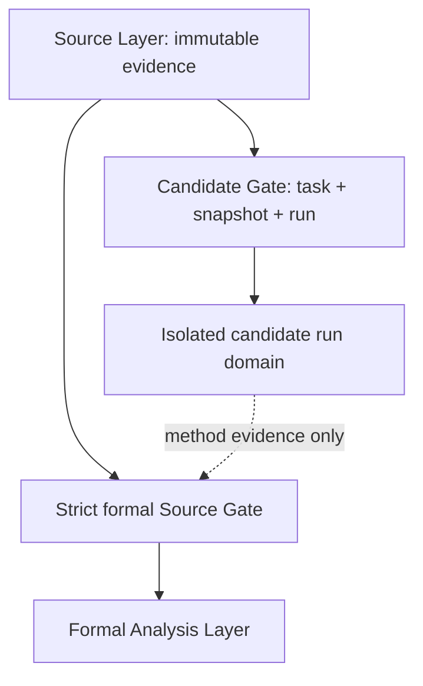
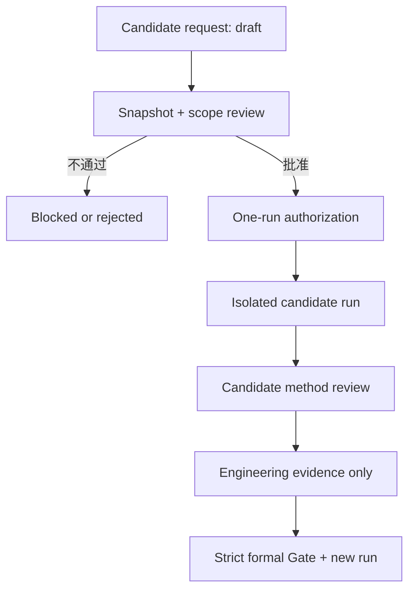

# Classic-to-Drama Engine：Analysis Candidate Workflow

> 项目：Classic-to-Drama Engine  
> 阶段：Phase 2-A  
> 文档类型：B-overlay 下的 `analysis_candidate` 工作流设计  
> 日期：2026-08-11  
> 文档状态：`ready_for_review`  
> 当前效力：`design_only / not_implemented`  
> Candidate 运行授权：否  
> Formal Phase 2 授权：否  
> 本文授权数据处理：否

## 0. 目的、依据与执行边界

本文把 `SOURCE_GATE_ARCHITECTURE_REVIEW.md` 推荐的 B-overlay 架构细化为可审查的 `analysis_candidate` 工作流。它只定义候选资格、输入快照、任务范围、单次运行身份、输出隔离、失效与正式交接规则，不执行任何候选或正式分析。

本文只依据：

- `SOURCE_GATE_ARCHITECTURE_REVIEW.md`；
- `ENGLISH_SOURCE_ANALYSIS_GATE_DECISION.md`；
- `GREEK_SOURCE_ANALYSIS_GATE_DECISION.md`；
- `03_WORKFLOW.md`。

本文不会：

- 读取 English 或 Greek TEI 正文；
- 修改 raw XML、SOURCE_RECORD、注册表、质量报告、Gate 决策或工作流状态；
- 创建 normalized、alignment、passage index 或其他派生来源层；
- 创建人物、事件、主题、故事事实或改编数据库；
- 生成短剧内容；
- 激活任何 `analysis_candidate` 资格；
- 解除 `BLOCKED_STRUCTURE_VALIDATION`、Gate S1 或正式 Phase 2 阻断。

## 1. `analysis_candidate` 定义

### 1.1 它是什么

`analysis_candidate` 是覆盖在现有 Source Gate 之上的、**任务级且单次运行级的受控使用资格**。它允许一个经过明确批准的候选运行，在不改变来源生命周期状态、也不进入正式 Stage 2 事实层的前提下，使用指定来源快照验证 analysis 方法与工程链路。

候选资格必须同时绑定以下四项，缺一不可：

```text
analysis_candidate = source_id + source_snapshot + task_scope + run_id
```

它具有以下性质：

- **来源特定：** 只能使用授权记录中列出的 `source_id` 与不可变快照；
- **任务特定：** 只允许执行已批准的有限任务，不授予开放式分析权限；
- **运行特定：** 授权只适用于一个唯一 `run_id`，不得由后续运行继承；
- **能力驱动：** 任务所需 locator、范围查询、alignment 或 normalization 能力必须与来源快照实际能力匹配；
- **可撤销／可失效：** checksum、Gate 状态、异常、任务范围或输入依赖变化时，资格立即失效；
- **非权威：** 所有内容输出均为 `candidate / non_authoritative`；
- **可复现：** 运行必须冻结来源、Gate、模型、prompt、schema、工具与参数身份；
- **不传递：** 候选运行不能把权限或内容结论传给正式 Phase 2 或任何下游阶段。

它位于三条正交控制轴的交点：

| 控制轴 | 回答的问题 | Candidate 所需状态 |
| --- | --- | --- |
| source lifecycle | 来源文件取得、验证与批准到哪一步 | 至少满足本任务所需的技术验证；不得伪写为 `approved` |
| analysis eligibility | 该来源对该任务能否作为候选输入 | `analysis_candidate`，且仅对所列任务与快照成立 |
| run authority | 这一次具体运行是否获准 | `candidate_run_authorized` |

三轴中任一项不满足时，运行必须保持 `not_authorized` 或 `blocked`。

### 1.2 它不是什么

`analysis_candidate` 不是：

- `acquired / verified / approved / locked` 等 source lifecycle 状态；
- English 或 Greek 来源的人工批准；
- Greek locator exception 的豁免、修复或 disposition；
- `BLOCKED_STRUCTURE_VALIDATION`、Gate S1 或正式 Phase 2 Gate 的解除；
- normalized layer、alignment layer、passage index 或新的 source 文件；
- 可供下游锁定的 Stage 2 正式事实；
- 可直接写入 `story_facts.jsonl`、`events.jsonl`、人物、主题、剧情或改编数据库的内容生产通道；
- 对同一来源、同一任务或同一工具未来运行的永久授权；
- 将 English `book.card` 转换或冒充为 Greek `book.line` 的机制；
- 用候选输出替代正式运行的捷径。

候选结果即使质量很好，也不会因此自动取得 `reviewed`、`approved` 或 `locked` 的正式产物身份。

### 1.3 当前项目中的非激活状态

本工作流设计本身不激活任何来源：

| 来源 | 当前来源状态 | 当前 analysis 权限 | 在本文后的状态 |
| --- | --- | --- | --- |
| Greek `ODY-GRC-MURRAY1919` | `acquired / verification_failed` | `reference-only` | 不变；不得作为 candidate 正文输入，只能提供来源身份、Gate 与 exception 元数据 |
| English `ODY-ENG-MURRAY1919` | `acquired / verified`；人工批准 `pending` | 尚非正式 analysis input | 不变；只具备未来申请 candidate 的技术基础，尚未获得候选运行授权 |

```yaml
candidate_workflow_status: design_only
candidate_architecture_approved: false
active_candidate_sources: []
candidate_run_authorized: false
formal_phase_2_status: blocked
```

## 2. Candidate 输入规则

### 2.1 输入合同

每次候选运行必须先创建独立的候选请求与输入清单。该记录是运行授权对象，不是来源状态文件。至少包含：

| 字段组 | 必填内容 | 规则 |
| --- | --- | --- |
| workflow identity | candidate contract 版本、请求状态、授权记录引用 | 请求必须按 `03_WORKFLOW.md` 的关键产物规则完成审查；`approved` 只批准该候选请求 |
| `source_id` | 一个或多个明确来源 ID 及各自角色 | 不允许使用通配符、“最新版本”或未登记来源 |
| source snapshot | 文件、commit、checksum、Gate 与能力快照 | 授权后不可在原 `run_id` 下变更 |
| task scope | 目的、允许操作、输入范围、输出类型、上限、停止条件 | 必须是有限任务，不得写成“分析全书”等开放授权 |
| `run_id` | 唯一、不可复用的候选运行标识 | 一个授权只对应一个运行；重跑必须分配新 ID |
| execution identity | 模型、prompt、schema、工具／代码与参数版本 | 运行前冻结；变更后视为新运行 |
| output contract | 隔离根目录、命名、标记、评审与留存规则 | 不得指向 Source Layer 或正式 Analysis Layer |

候选请求在获得明确批准以前必须保持：

```yaml
analysis_eligibility: not_granted
run_authority: not_authorized
formal_phase_2_input: false
```

### 2.2 `source_id` 规则

1. 每个输入必须使用现有来源登记中的精确 `source_id`；不能仅以文件名、语言名或仓库 URL 代替。
2. 同一运行使用多个来源时，必须为每个来源声明角色，例如：
   - `candidate_working_source`；
   - `reference_metadata_only`；
   - `comparison_source`；
   - `not_content_readable`。
3. 角色不具传递性。一个来源在任务 A 中为 `candidate_working_source`，不表示它在任务 B 中也可用。
4. 当前 Greek 只能登记为 `reference_metadata_only / not_content_readable`；候选程序不得打开其正文文件。
5. 当前 English 在 B-overlay 契约获批且本次请求另获授权后，才可能登记为 `candidate_working_source`；本文没有赋予该角色。

### 2.3 Source snapshot 规则

`source_snapshot` 是候选运行所依赖的不可变来源与 Gate 身份清单，不是 raw 文件的副本。每个来源快照至少冻结：

- `source_id` 与 `file_id`；
- source lifecycle 当前值及其证据文件引用；
- raw 文件批准路径；
- fixed upstream commit；
- SHA-256 与文件大小；
- edition、language、provider 与来源角色；
- 原生 locator scheme 及已验证能力；
- `native_locator_readable`、`canonical_range_supported`、`alignment_available`、`normalization_required` 等任务能力声明；
- 适用的 SOURCE_RECORD、Source Gate 决策与 Gate 快照引用；
- 已知 exception、blocker、限制与不可用能力；
- 快照生成时间、合同版本和复核者／批准记录。

快照规则：

1. 候选运行只读原批准路径，不修改、不覆盖、不就地清洗 raw；
2. 快照必须使用完整 checksum，不得只凭文件名或 commit 推断字节身份；
3. 快照授权后，如 checksum、文件路径、来源状态、Gate 决策、exception disposition 或所需能力发生变化，原授权立即失效；
4. 如果任务需要快照未声明的 locator、alignment 或 normalization 能力，运行必须停止并返回 `blocked_missing_capability`；
5. 不得在候选运行内部静默生成 normalized 文件、重排 locator、补缺或创建跨来源映射；
6. Gate snapshot 只记录授权时事实，不得反向修改 Source Layer 当前状态。

### 2.4 Task scope 规则

每个 `task_scope` 必须回答：

- 本次运行要验证的唯一主要能力是什么；
- 允许执行哪些 analysis 操作；
- 允许读取哪些来源及其角色；
- 允许读取哪些原生 locator 范围；
- 最大输入范围、样本量、输出条目数、运行次数与成本边界；
- 输出 schema、候选命名和评估标准是什么；
- 明确排除哪些任务与下游写入；
- 遇到何种异常、缺失 locator、身份不一致或范围外请求时必须停止；
- 谁批准该范围，以及批准只适用于哪个 `run_id`。

范围必须使用来源的原生 locator 表达。当前 English 若未来获准，只能使用 `book.card`；不得在候选范围中声明 Greek `book.line`、虚构 canonical span 或假定 English–Greek 已对齐。

以下任务变更均要求新候选请求和新 `run_id`：

- 扩大 Book、card、样本或输出数量；
- 增加人物、事件、主题、时间线或其他分析类型；
- 更换或增加来源；
- 更换模型、prompt、schema、解析器或关键参数；
- 增加 normalization、alignment、索引或范围查询要求；
- 将工程验证改为内容生产或下游数据库写入。

### 2.5 Run identifier 规则

候选运行 ID 采用以下格式：

```text
AC-YYYYMMDD-TASKSLUG-NNN
```

规则如下：

- `AC` 固定表示 `analysis_candidate`；
- 日期使用运行授权日期；
- `TASKSLUG` 是稳定、简短、不可含来源正文含义的任务标识；
- `NNN` 是当日同任务的三位顺序号；
- ID 一经分配不得修改、复用或被 formal run 沿用；
- 失败、取消、拒绝或失效的 ID 也永久保留在审计记录中；
- 重跑必须使用新 ID，并用 `supersedes_run_id` 或 `retry_of_run_id` 指向前次运行；
- 正式 Phase 2 使用独立的 formal run 命名空间，不能把 `AC-...` 改名冒充正式运行。

上述格式只是合同模板，不代表当前已经创建任何候选运行。

### 2.6 候选入口 Gate

候选请求只有在下列条件全部满足后，才能取得一次性的 `candidate_run_authorized`：

1. B-overlay 工作流已经独立批准并写入有效项目合同；
2. 候选来源的 raw 身份、commit、path、size 与 SHA-256 可复核；
3. 来源身份、语言、edition、角色和本任务所需原生 locator 能力已技术验证；
4. 已知异常已登记，且证明不会被本次任务静默绕过或误引；
5. `source_snapshot` 与 `task_scope` 已完成独立审查；
6. 输入范围、输出隔离根、最大运行边界、停止条件和评估方法已明确批准；
7. 模型、prompt、schema、工具和参数版本已经冻结；
8. 所有来源路径为只读，candidate 路径与 formal 路径物理／逻辑隔离；
9. 授权记录明确写出 `formal_phase_2_input: false` 与 `candidate_output_promotable: false`；
10. Orchestrator 在启动前重新验证 checksum、Gate snapshot 与授权仍有效。

任一条件失败时不得降级为“部分授权”；请求保持 `blocked` 或 `rejected`，正文不得被读取。

## 3. Candidate 输出隔离规则

### 3.1 唯一候选运行域

未来若候选运行获批，其所有运行记录与输出只能位于以下独立根目录：

```text
analysis_candidate/runs/<run_id>/
```

该路径位于 `source/` 之外，也不得与正式 Stage 2 的 analysis 输出目录重合。本设计不创建该目录。

| 候选路径 | 内容 | 约束 |
| --- | --- | --- |
| `<run_id>/run_manifest.yaml` | 运行身份、状态、授权与完整文件清单 | 唯一入口清单；必须标记非正式 |
| `<run_id>/input/source_snapshot.yaml` | 来源与 Gate 身份快照 | 只保存身份、能力与引用，不复制或嵌入正文 |
| `<run_id>/input/task_scope.yaml` | 获批任务边界与停止条件 | 授权后只读 |
| `<run_id>/input/execution_snapshot.yaml` | 模型、prompt、schema、工具与参数版本 | 用于重现运行，不授予 formal 权限 |
| `<run_id>/output/` | 候选内容或方法输出 | 文件名必须以 `candidate__` 开头 |
| `<run_id>/evaluation/` | 自动检查、抽样评审和失败案例 | 不能把通过结果写成正式 Gate 通过 |
| `<run_id>/logs/` | 运行日志、错误与终止原因 | 不得包含未授权来源正文副本 |
| `<run_id>/CANDIDATE_REVIEW.md` | 候选运行结论与方法建议 | 只评价候选方法，不批准文学事实 |

### 3.2 强制身份标记

每个候选输出及其 manifest 至少携带：

```yaml
artifact_class: analysis_candidate
authority: non_authoritative
run_id: AC-YYYYMMDD-TASKSLUG-NNN
source_snapshot_id: <immutable-snapshot-id>
task_scope_id: <approved-scope-id>
formal_phase_2_input: false
candidate_output_promotable: false
downstream_consumption_allowed: false
```

候选文件不得只依赖目录名表达身份。若输出格式不能内嵌元数据，必须由 `run_manifest.yaml` 提供一对一文件登记和 checksum。

### 3.3 写入与发现隔离

- Source Layer 与正式 Analysis Layer 对 candidate 进程保持只读或不可写；
- candidate 只能写入自己的 `<run_id>/`，不得写入其他候选运行目录；
- 不得在 `source/`、raw 路径、SOURCE_RECORD 路径或正式 Stage 2 输出位置写入中间文件；
- 不得创建 normalized、cleaned、sorted、repaired、aligned 或 passage-indexed 来源副本；
- 正式 Stage 2 的文件发现、manifest 生成与下游加载规则必须显式排除 `analysis_candidate/`；
- 候选文件不得占用正式输出的裸文件名。即使测试正式 schema，也必须使用 `candidate__<formal-name>`；
- candidate manifest 不得被加入正式 `source_manifest`、Stage 2 输出清单、人物／事件／主题数据库或任何下游锁定依据；
- 不允许通过复制、移动、重命名、链接或修改状态字段把候选内容送入正式目录；
- 候选运行结束后，其输出只用于审计、错误分析、方法比较和工程评审。

### 3.4 完成、失败与失效

候选运行结束时必须写明一种技术运行结果：`completed`、`failed`、`cancelled` 或 `invalidated`。这些值只描述执行结果，不是正式产物状态。

以下情况必须把运行标记为 `invalidated`，并禁止继续消费其输出：

- 输入 checksum、路径、commit 或来源身份与快照不一致；
- 来源状态、Gate、exception 或任务依赖在运行期间发生影响性变化；
- 实际读取范围超出 `task_scope`；
- 实际模型、prompt、schema、工具或关键参数与冻结快照不一致；
- 发生未授权 normalization、alignment、locator 重排、补缺或来源覆盖；
- 输出进入 candidate 根以外的路径；
- 无法证明输出与 `run_id`、来源快照的一对一追溯关系。

`completed` 只表示候选运行按合同结束，不表示分析结论正确、来源获批、Gate 解除或正式 Phase 2 就绪。

## 4. Candidate 晋级条件

### 4.1 晋级对象的严格区分

B-overlay 下不存在“把 candidate 内容文件直接改成正式文件”的自动晋级。必须区分三种对象：

| 对象 | 是否可进入正式流程 | 规则 |
| --- | --- | --- |
| 来源文件 | 可以，但只能通过原 Source Gate | Candidate 不改变其生命周期；必须另行取得 `approved / formal_analysis_input` |
| 工程资产 | 可以有条件复用 | parser、代码、prompt、schema、测试夹具和评估规则须独立评审、版本化并获批 |
| 候选内容结论 | 默认不可原地晋级 | 不得复制、改名或改状态；正式 Phase 2 应从获批输入重新运行 |

因此，“Candidate 晋级”准确含义是：候选阶段验证过的方法可以申请成为正式运行方法，且项目在严格 Gate 闭合后可以创建一个新的 formal run；它不表示候选语义输出本身变成正式故事事实。

### 4.2 进入正式 Phase 2 的必要条件

只有以下条件全部满足，才可以从候选准备转入新的正式 Phase 2 运行：

1. **正式 Source Gate 闭合：** 必需来源存在、版本明确、技术验证与人工批准完成；
2. **English 正式获批：** 当前 English 的独立人工批准完成，SOURCE_RECORD 与注册表按有效批准记录同步为正式可用；
3. **Greek reference backbone 解阻：** exception resolution、locator 合同与选定 R1／R2 路径获批并执行，`BLOCKED_STRUCTURE_VALIDATION` 有证据地解除；
4. **其余正式前置条件完成：** Required CTS metadata、Gate S1、最小正式 analysis 输入、只读输入与派生标记契约全部通过；
5. **候选方法通过评审：** 运行完整、范围未越界、失败模式已登记，parser／prompt／schema／评估规则没有未解决的阻断项；
6. **正式任务另行批准：** 明确 formal scope、输入、输出位置、质量门槛、评审人和启动授权；
7. **正式输入重新冻结：** formal run 启动前重新计算或复核所有输入身份与 checksum；不能直接继承旧 candidate snapshot 的有效性；
8. **分配新的 formal run ID：** 不沿用、不改名、不覆盖 `AC-...`；
9. **从获批输入重新运行：** 正式内容结果由 formal run 重新计算，并按 Gate S2 接受独立检查与人工裁决；
10. **保持审计分离：** formal manifest 可以引用候选运行作为方法验证证据，但不能把候选内容列为正式输入或事实来源。

Candidate 运行完成、候选评审通过、English 单来源技术验证通过，或某一项 Source Gate 单独解除，都不足以启动正式 Phase 2。

### 4.3 禁止自动晋级

以下机制必须被工作流与 Orchestrator 明确禁止：

- `candidate -> approved` 的单字段自动转换；
- 将 `candidate__story_facts.jsonl` 等文件移入正式目录后删除前缀；
- 以同一个 checksum 或内容相同为理由继承候选产物身份；
- 让 formal run 读取 candidate 内容作为已知事实、提示缓存或数据库种子；
- 以候选评审替代 Source Gate、Gate S1、Gate S2 或人工批准；
- 因候选输出流畅而跳过正式重跑与来源引用复核。

如果未来确需保留某个候选内容，必须另立再认证决策，证明其基于当时已获批的同一输入和正式合同重新验证，并为其创建新的正式身份；该例外不由本文授权，默认路径仍是正式重跑。

## 5. 与 Source Layer、Candidate Layer 和 Analysis Layer 的关系



### 5.1 Source Layer

Source Layer 负责保存来源证据与生命周期事实：raw、SOURCE_RECORD、commit、checksum、provider、edition、原生 locator、quality report、exception 与批准状态。

与 candidate 的关系：

- Source Layer 是只读输入与身份真相来源；
- candidate 通过 snapshot 引用 Source Layer，不复制、不修复、不重写它；
- candidate 资格不回写 `verified`、`approved`、`locked` 或其他来源状态；
- Greek 当前只提供 provenance、Gate 与 exception 元数据，不提供 candidate 正文；
- English 只有在未来候选请求获批后，才可按 `book.card` 和批准范围作为候选工作输入。

### 5.2 Candidate Layer

Candidate Layer 是 Source Layer 与正式 Analysis Layer 之间的隔离 preflight 域，负责：

- 验证 parser、分包、prompt、schema、模型行为、失败模式、评估方法和运行成本；
- 证明某个明确方法在某个固定来源快照与有限任务范围内是否可执行；
- 保存非权威输出、运行证据和方法评审；
- 阻止候选内容被下游发现、继承或锁定。

Candidate Layer 不拥有来源生命周期，也不拥有正式文学事实。其主要可复用价值是工程证据，而不是内容结论。

### 5.3 Formal Analysis Layer

Formal Analysis Layer 对应 `03_WORKFLOW.md` 的 Stage 2，负责从获批来源生成可追踪的正式故事事实、事件、地点、物件、母题、时间信息与歧义记录，并接受 Gate S2。

与 candidate 的关系：

- 只在严格 formal Gate 和独立启动授权通过后运行；
- 只读取 formal manifest 中列出的获批来源与正式输入；
- 可以采用另行获批的候选工程资产版本；
- 不读取、导入或继承候选内容结论；
- 使用新的 formal run ID，从重新冻结的输入重新生成正式输出；
- 输出只有在模式、来源、独立评审与人工条件满足后，才可按全局状态机进入下游。

### 5.4 Orchestrator 的边界责任

Orchestrator 必须：

1. 分别检查 source lifecycle、analysis eligibility 与 run authority；
2. 在启动前验证 snapshot、scope、run ID、授权和隔离路径；
3. 只向 candidate Agent 提供最小获批输入范围；
4. 阻止 Greek 正文、范围外 English card 或未登记来源进入候选上下文；
5. 阻止 candidate 输出写入 formal manifest 或下游数据库；
6. 记录失败、越界、失效与重新授权原因；
7. 在 formal run 启动时重新执行严格 Gate，不继承 candidate 的运行权限。

## 6. 端到端候选流程



执行顺序为：

1. 提出一个有限候选任务，分配预留 `run_id`；
2. 冻结 source snapshot、task scope、execution snapshot 与 output contract；
3. 独立评审任务能力匹配、已知异常和隔离边界；
4. 仅对该 `run_id` 记录 `candidate_run_authorized`；
5. Orchestrator 在启动前复核 Gate 与 checksum；
6. 在独立 candidate 根内执行，范围外请求立即停止；
7. 校验输出身份、provenance、范围、路径和禁止写入项；
8. 评审方法、失败模式和工程资产，不批准候选文学事实；
9. 关闭运行并记录 `completed / failed / cancelled / invalidated`；
10. 若要进入正式 Phase 2，返回第 4.2 节完成严格 Gate，创建新的 formal run 并重算。

## 7. 本阶段设计结论与未执行动作

```yaml
phase: Phase 2-A
task: Analysis Candidate Workflow Design
document: ANALYSIS_CANDIDATE_WORKFLOW.md
document_status: ready_for_review

architecture: B_overlay
analysis_candidate_is_source_lifecycle_status: false
candidate_binding_fields:
  - source_id
  - source_snapshot
  - task_scope
  - run_id
candidate_output_root_template: analysis_candidate/runs/<run_id>/
candidate_output_promotable: false
formal_phase_2_requires_new_run: true

greek_analysis_eligibility: reference_only
english_source_status: verified
english_human_approval: pending
active_candidate_sources: []
candidate_run_authorized: false
formal_phase_2_authorized: false

english_tei_content_read_this_task: false
greek_tei_content_read_this_task: false
source_or_status_files_modified_this_task: 0
normalized_or_alignment_files_created_this_task: 0
analysis_runs_executed_this_task: 0
character_event_theme_databases_created_this_task: 0
short_drama_outputs_created_this_task: 0
```

本文完成只表示 B-overlay 下的候选工作流已经形成可评审设计。它不构成 candidate 架构批准、来源批准、运行授权、Gate 解除、数据处理或正式 Phase 2 启动。
