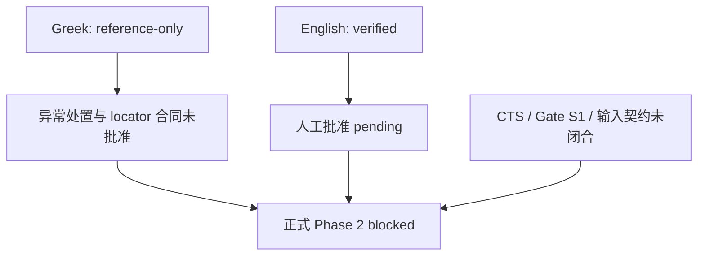

# Classic-to-Drama Engine：Source Gate Architecture Review

> 项目：Classic-to-Drama Engine  
> 阶段：Phase 1-G  
> 文档类型：Source Gate 架构评审  
> 日期：2026-08-11  
> 文档状态：`ready_for_review`  
> 评审结论：推荐方案 B，但将 `analysis_candidate` 设计为独立的、任务级使用资格层，而不是来源生命周期状态  
> 本文授权数据处理：否  
> 本文修改状态文件：否

## 0. 评审目的、范围与结论

本文审查 Phase 1 Source Gate 是否既能保护来源可信度，又适合在进入正式 Phase 2 前验证真实 AI analysis 工作流。评审只依据以下五份现有文档：

- `GREEK_SOURCE_ANALYSIS_GATE_DECISION.md`；
- `ENGLISH_SOURCE_ANALYSIS_GATE_DECISION.md`；
- `SOURCE_MANIFEST.md`；
- `01_SOURCE_PACKAGE_STRUCTURE.md`；
- `03_WORKFLOW.md`。

本文不分析《奥德赛》正文，不创建人物、事件、主题、剧情或改编数据，不执行 normalization，不批准来源，不解除 Gate，也不修改任何现有状态文件。

总体结论如下：

1. **当前严格 Gate 适合保护正式 Phase 2 产物。** raw 不可变、commit/checksum 固定、来源身份验证、已知异常显式登记、人工批准和可追溯性都应保留。
2. **当前 Gate 不适合作为所有 AI analysis 活动的唯一总开关。** 它把“来源是否可信”“来源是否适合某个具体任务”“本次运行是否获准”合并为一次全有或全无的判断，使已经技术验证的 English 工作文本也无法用于受控的真实试运行。
3. **推荐方案 B。** 增加 `analysis_candidate`，但它不得写入或替代 `acquired / verified / approved / locked` 等来源生命周期状态；它应是针对特定来源、特定任务和特定运行的可撤销资格。
4. **方案 B 不解除当前阻断。** 在该架构经过独立批准并被正式写入后续契约前，Greek 仍为 `reference-only`，English 仍为 `verified but pending`，正式 Phase 2 仍为 `blocked / not_authorized`。

## 1. 当前 Gate 状态总结

### 1.1 来源级状态

| 来源 | 当前技术状态 | 当前使用权限 | 未完成门槛 | 当前 Phase 2 角色 |
| --- | --- | --- | --- | --- |
| Greek `ODY-GRC-MURRAY1919` | `acquired / verification_failed` | `reference-only` | 三项 locator exception 的 disposition、验证合同与 locator 合同批准、结构阻断解除、后续人工批准 | reference backbone；仅作 provenance／citation anchor，不得作为 analysis corpus |
| English `ODY-ENG-MURRAY1919` | `acquired / verified` | 技术合格但尚未成为正式 analysis input | 独立人工批准、状态同步、项目级 Source Gate、Phase 2 独立启动授权 | 预定为 `primary_working_text`；当前仍为 `verified but pending` |

Greek 与 English 的职责分离本身是合理的：Greek 提供规范引用脊柱，English 提供 AI 可读的主要工作文本。两者使用不同的原生定位体系——Greek 为 `book.line`，English 为 `book.card`——不能把 English 的技术通过解释为 Greek locator 已经可用，也不能用 English 修复 Greek 异常。

### 1.2 项目级阻塞链



当前不是“English 文件不可用”，而是三个不同层次尚未同时闭合：

- **来源可信度层：** English 已通过；Greek 部分通过但 locator 消费就绪失败。
- **来源批准层：** English 人工批准 pending；Greek 异常处置与后续批准未完成。
- **项目运行层：** Gate S1、CTS metadata、输入／派生契约与 Phase 2 启动授权未完成。

因此，“正式 Phase 2 不可启动”是现有合同下的正确结论；但这不自动证明所有受控 analysis 试运行都必须等待相同的完整门槛。

### 1.3 当前状态语义存在的架构漂移

五份文档的原则大体一致，但状态与门槛的表达尚未完全统一：

1. `03_WORKFLOW.md` 的全局状态机使用 `draft / reviewed / approved / locked / rejected / blocked`；来源执行文档同时使用 `pending / acquired / verified / verification_failed`。两组词汇承担不同职责，但目前没有统一的字段命名和映射规则。
2. `SOURCE_MANIFEST.md` 仍为 `draft_recommendation`，部分结论仍按“来源尚未获取”的设计时快照表述；两个 Source Analysis Gate 已记录后来发生的实际获取与验证状态。若没有文档版本优先级，执行器可能把历史说明误读为实时状态。
3. `SOURCE_MANIFEST.md` 与 `03_WORKFLOW.md` 倾向把 normalized text、passage index 和 English–Greek alignment 作为 Gate S1 的完整前置项；English Gate 又明确说明当前 raw TEI 技术上不强制 normalization。这里需要区分“所有正式分析都必须具备的最小输入”与“仅 locator-sensitive 任务需要的附加输入”。
4. 当前 Gate 主要以整包是否完成来判断放行，尚未显式表达某个来源对某类任务的局部能力。例如 English 可支持 `book.card` 原生定位，但不能生成 Greek `book.line` 规范引用；这应是任务能力约束，不应只压缩成一个全局 `blocked`。

这些漂移不会证明现有来源不可信，但会增加误判、重复审批与实现等待时间；在正式 Phase 2 前应完成契约统一。

## 2. 当前阻塞链分析

### 2.1 必要的质量控制

| 控制项 | 为什么必要 | 是否应保留 |
| --- | --- | --- |
| 固定上游 commit、raw 路径和 SHA-256 | 确保输入字节可复现，避免上游变化被静默引入 | 必须保留 |
| raw 不可变，normalized 独立登记 | 保留来源证据并使任何转换可审计、可回溯 | 必须保留 |
| XML／UTF-8／TEI 身份／版本身份／24 Books 验证 | 防止错误文件、截断文件或错误版本进入模型 | 必须保留 |
| Greek locator exception 显式登记 | 防止 Book 3／14 顺序问题与 Book 16 缺口被静默重排或补造 | 必须保留 |
| Greek 与 English locator 权限分离 | 防止 `book.card` 冒充 `book.line`，保护规范引用真实性 | 必须保留 |
| 人工批准正式来源角色 | 对正式事实层和下游可继承产物提供责任边界 | 正式 Phase 2 必须保留 |
| analysis 输出携带来源、checksum、locator 与工具版本 | 支持回归、复核、重跑和影响分析 | 必须保留 |
| 正式 Phase 2 独立启动授权 | 防止单文件技术通过被误解为整条生产流水线已放行 | 必须保留 |

这些控制直接保护“来源可信”和“下游可继承”，不应为了速度取消。

### 2.2 可能影响开发效率的阻塞

| 当前阻塞方式 | 效率影响 | 架构判断 |
| --- | --- | --- |
| English 必须等待 Greek 全部结构异常闭合后才能进行任何真实 analysis | 无法提前验证 parser、分包、prompt、输出 schema、模型误差和成本 | 对正式事实层必要；对隔离的候选试运行过度耦合 |
| English 技术验证与 English 人工批准之间没有中间使用权限 | `verified` 文件只能继续等待，无法产生工程反馈 | 应增加任务级候选权限，但不能等同于正式批准 |
| 整个 P0 / Gate S1 未完成即禁止所有 analysis | 一个不影响当前试验的 CTS 或辅助来源缺项也会阻断工具链验证 | 正式入口合理；候选入口应按任务依赖裁剪 |
| normalization 在部分文档中被视为普遍前置条件 | 即使 raw TEI 已满足某任务，也可能被迫先构建暂时不需要的派生层 | 应改为能力驱动：任务确实依赖稳定 passage／严格 locator 时才强制 |
| 状态词汇与文档快照不统一 | 执行器需要反复人工解释“哪个状态才是当前事实” | 属于架构债务，应在正式 Phase 2 前消除 |
| 一个总 Gate 同时承担来源生命周期、任务适配和运行授权 | 任一局部阻断会传播到所有任务，无法表达有限可用性 | 应拆成三条正交控制轴 |

效率问题的根源不是“Gate 太多”，而是 Gate 的粒度与职责没有完全解耦。

## 3. 两种方案评估

### 3.1 方案 A：保持当前严格 Gate

方案 A 继续要求完整 Source Package、所有相关人工批准、Greek 结构阻断解除和 Phase 2 独立授权全部完成后，才允许任何正文进入 AI analysis。

优点：

- 规则简单，只有“未放行／正式放行”两类结果；
- 最大限度降低候选结果被误用为正式事实的风险；
- 与 `03_WORKFLOW.md` 中“只有 approved 输入可作为下游锁定依据”的原则完全一致；
- 不需要新增 candidate 运行、隔离输出或失效处理机制。

缺点：

- 将工程验证推迟到所有来源和批准问题解决之后，可能在 Phase 2 启动时才暴露 parser、分包、schema、prompt 或成本问题；
- English 已验证能力不能提前产生反馈，Greek 的 locator 局部异常会阻塞与 Greek 正文消费无关的工具链试验；
- 容易把“不能产出正式事实”扩大解释为“不能做任何真实模型试验”；
- 对其他经典文本复用时，每个项目都可能重复经历长时间的全局等待。

适用判断：方案 A 适合作为**正式生产入口**，不适合作为唯一的开发与验证入口。

### 3.2 方案 B：增加 `analysis_candidate` 中间状态

若把 `analysis_candidate` 直接加入来源生命周期，例如形成 `verified -> analysis_candidate -> approved`，会产生两个问题：

1. 它把“文件本身的状态”与“某个任务能否使用该文件”再次混在一起；
2. 同一来源可能对任务 X 可用、对任务 Y 不可用，单一文件状态无法准确表达。

因此，方案 B 只有在以下修正后才推荐：

> `analysis_candidate` 不是来源生命周期状态，而是一个由“来源身份 + 具体任务 + 输入能力 + 单次运行范围”共同决定的使用资格层。

该资格应具备以下性质：

- **任务级：** 明确候选运行要验证的能力，不授予开放式 analysis 权限；
- **范围级：** 明确允许的 Book／card／样本范围和最大输出范围；
- **可撤销：** checksum、来源状态、exception 或任务依赖变化时立即失效；
- **非传递：** candidate 输出不能自动成为 Stage 2 正式事实，更不能流入人物、事件、主题或改编数据库；
- **隔离：** candidate 输出位于 Source Package 之外的候选运行域，并带显著的非正式标记；
- **可复现：** 保存 source/file identity、commit、checksum、原生 locator、Gate 快照、模型、prompt、schema 和运行版本；
- **不改 raw：** 不允许候选运行静默 normalization、重排、补缺或覆盖来源文件。

优点：

- 可在正式 Gate 闭合前验证真实 AI 工作流，而不把候选结论当成正式事实；
- 可以按任务依赖决定是否需要 Greek、CTS、alignment 或 normalized layer，减少无关阻塞；
- 可提前形成 parser、schema、prompt、评估集和失败案例，正式 Phase 2 启动后复用工程资产；
- 适用于后续其他经典文本，不依赖《奥德赛》的特定异常。

风险：

- candidate 输出可能被误复制、误引用或误升级；
- 状态命名如果没有拆轴，可能让执行者误以为来源已获批准；
- 真实 semantic analysis 即使是候选，也可能形成难以清除的非正式事实缓存；
- 若候选试验范围过大，会实质上绕过正式 Gate。

这些风险可以通过运行级授权、输出隔离、禁止原地升级和强制正式重跑控制，而不需要放弃方案 B。

### 3.3 对比结论

| 维度 | 方案 A：严格 Gate | 方案 B：候选资格层 |
| --- | --- | --- |
| 正式来源可信度 | 高 | 高，前提是正式 Gate 不变 |
| 提前工程反馈 | 低 | 高 |
| 状态简单度 | 高 | 中，需要三轴模型 |
| 误用候选结果风险 | 低 | 中，可通过隔离与禁止晋级降低 |
| 对不同任务的适配 | 低，整包全有或全无 | 高，可按任务能力判断 |
| 跨作品复用 | 中 | 高 |
| 当前是否可直接执行 | 是，继续保持阻断 | 否；必须先批准并写入新契约 |

## 4. 推荐方案

### 4.1 推荐：B-overlay，而不是 B-lifecycle

推荐保留方案 A 作为正式 Phase 2 的生产 Gate，同时增加方案 B 作为独立的候选运行通道。二者不是互相替代，而是分别解决不同问题：

- **正式 Gate：** 决定哪些输入和输出可以成为下游锁定依据；
- **candidate Gate：** 决定一次受控试运行能否读取特定来源并生成隔离的非正式结果。

建议将状态拆成三条正交轴：

| 控制轴 | 回答的问题 | 示例值 |
| --- | --- | --- |
| source lifecycle | 文件本身取得、验证和批准到哪一步 | `acquired`、`verified`、`verification_failed`、`approved`、`locked` |
| analysis eligibility | 该来源对当前任务具有什么使用资格 | `reference_only`、`analysis_candidate`、`formal_analysis_input` |
| run authority | 本次具体运行是否获准 | `not_authorized`、`candidate_run_authorized`、`formal_run_authorized` |

`analysis_candidate` 只有在三轴同时检查时才有意义。它不能把 `verified` 改写为 `approved`，也不能把 `candidate_run_authorized` 改写为 `formal_run_authorized`。

以下只是未来契约的非执行性示例，不表示当前 English 已被激活为 candidate：

```yaml
source_lifecycle_status: verified
analysis_eligibility: analysis_candidate
run_authority: candidate_run_authorized
formal_phase_2_input: false
candidate_output_promotable: false
```

### 4.2 Candidate 入口条件

未来只有下列条件全部满足时，某一来源才能针对某一任务获得 `analysis_candidate` 资格：

1. raw 已实际取得，固定 commit、路径、字节数和 SHA-256 可复核；
2. 来源身份、版本、语言、角色和原生 locator 已通过技术验证；
3. 已知异常已登记，并证明不会使本次候选任务产生静默错引；
4. 候选任务明确列出必需能力，例如只需要 `book.card`，还是必须需要 `book.line`、连续范围或跨版本 alignment；
5. 输入范围、允许的分析类型、最大运行范围、输出位置和终止条件已被单独批准；
6. raw 只读，所有候选输出带 `candidate / non_authoritative` 标记和完整 provenance；
7. 候选输出不得写入正式事实、人物、事件、主题、剧情或改编数据域；
8. 候选运行不能补造缺失 locator、静默重排来源或建立未经批准的跨版本映射；
9. checksum、Gate 快照或任务依赖变化时，资格自动失效并要求重新评估。

### 4.3 当前 Greek 与 English 在推荐架构中的位置

在不改变现有状态的前提下，当前判断是：

- **Greek：继续 `reference-only`。** 其 `verification_failed` 和 unresolved locator exceptions 不满足 candidate 正文消费条件。候选任务可以引用 Greek 的来源身份与 exception 元数据，但不得读取 Greek 正文形成分析结论。
- **English：具备未来申请 candidate 的技术基础，但当前不是 active candidate。** 只有方案 B 的契约获批、candidate run 另行授权后，English 才可在明确范围内进行真实但非正式的 AI analysis 试运行；其输出只能使用 English 原生 `book.card`，并明确标注 `canonical_span: pending / unavailable_for_candidate`。
- **正式 Phase 2：仍不允许。** Candidate 资格不能绕过 English 人工批准、Greek reference backbone 解阻、Gate S1 或正式启动授权。

### 4.4 同时保证来源可信、开发效率与可复用性

#### 来源可信

- 保留 raw、commit、checksum、来源身份和 exception 的全部现有硬约束；
- candidate 只使用已技术验证且与任务能力匹配的来源；
- 正式事实仍要求获批输入、有效 locator 和完整 provenance；
- candidate 内容输出不得原地升级，正式 Phase 2 必须从获批输入重新运行或经过独立、显式的再认证流程。

#### 开发效率

- 允许 English 在 future candidate Gate 下提前验证 parser、分包策略、prompt、schema、模型失败模式和运行成本；
- 按任务依赖要求 CTS、Greek、alignment 或 normalized layer，避免无关资产阻塞所有试验；
- 把全书正式运行拆成有限样本候选与获批后的正式运行，提前发现工程问题。

#### 可复用性

- 将 candidate policy 写成作品无关的运行契约，而不是《奥德赛》专用例外；
- 把“来源能力”显式化，例如 `native_locator_readable`、`canonical_range_supported`、`alignment_available`、`normalization_required`；
- 可复用 candidate 阶段产生的代码、schema、prompt、测试夹具和评估规则，但不复用其未经批准的文学事实；
- 每次运行固定模型、prompt、schema、来源和 Gate 快照，便于跨作品复跑与比较。

## 5. 对 Phase 2 的影响

### 5.1 当前影响

本评审不改变当前入口结论：

```yaml
greek_analysis_eligibility: reference_only
english_source_status: verified
english_human_approval: pending
english_formal_analysis_input: false
formal_phase_2_status: blocked
candidate_architecture_status: recommendation_only
candidate_run_authorized: false
```

### 5.2 若保持方案 A

Phase 2 只能在现有完整 Gate 闭合后启动。启动前至少需要：

1. Greek exception resolution、locator 合同和选定 R1／R2 路径获批并执行；
2. Greek 结构阻断有证据地解除，来源状态按合同同步；
3. English 获得独立人工批准并同步为正式可用来源；
4. CTS metadata、Gate S1、最小 analysis 输入、只读与派生标记契约完成；
5. Phase 2 获得独立启动授权。

在此之前不进行任何真实正文 analysis。优点是边界最清楚，代价是所有工具链问题都延后暴露。

### 5.3 若采纳方案 B

Phase 2 应被拆成两个不会互相冒充的运行通道：

1. **Phase 2 candidate / preflight 通道**  
   在候选架构和具体运行获得批准后，可用 English 的固定 raw、checksum 与 `book.card` 做有限、真实、非正式的 AI analysis 试运行。该通道只验证方法和系统，不产生可下游继承的故事事实或数据库。

2. **Phase 2 formal 通道**  
   仍按方案 A 的完整 Gate 启动。正式运行不得直接继承 candidate 的内容结论；应从获批输入重新计算，或对确需保留的候选产物执行独立再认证并形成新的正式身份。

方案 B 能提前验证技术路径，但不会缩短 Greek reference backbone、English 人工批准或正式 Gate 的证据要求。

### 5.4 Phase 2 前必须消除的架构歧义

无论采用 A 或 B，正式 Phase 2 前都应另立任务完成以下契约修订与批准：

1. 统一全局状态机与来源生命周期字段，明确 `pending / acquired / verified / verification_failed` 与 `draft / reviewed / approved / locked / blocked` 的关系；
2. 定义文档版本与事实优先级，区分设计时结论、单次任务快照和当前实时状态；
3. 明确“最小正式 analysis Gate”与“完整 Source Package Gate”的差别，避免不相关辅助资产无限阻塞核心分析；
4. 将 normalization、passage index 和 alignment 改为按任务能力触发，或明确它们为何对所有正式任务均为强制；
5. 为 candidate run 定义独立 schema、输出隔离规则、失效条件、禁止晋级规则和审计字段；
6. 明确 candidate 与 formal 两条通道的命名，禁止 candidate 文件出现在正式 Stage 2 输出清单中。

这些是后续架构实施条件，不是本文已经执行的修改。

## 6. 最终推荐与决策边界

最终推荐为：

- 正式 Phase 2 继续采用当前严格 Gate；
- 增加经过约束的 `analysis_candidate` 通道，用于真实但非正式的有限 AI analysis；
- `analysis_candidate` 作为任务级资格 overlay，不进入来源生命周期状态机；
- 当前 Greek 不具备 candidate 正文消费资格；
- 当前 English 只具备未来申请 candidate 的技术基础，尚未获得 candidate 或 formal 运行授权；
- candidate 只复用工程资产，不自动复用内容结论；
- 在状态语义、最小 Gate、normalization 条件和 candidate schema 获批前，不启动任何 candidate 或 formal analysis。

```yaml
review_outcome: recommend_option_B_overlay
strict_formal_gate_retained: true
analysis_candidate_recommended: true
analysis_candidate_is_source_lifecycle_status: false
current_source_states_changed: false
current_gate_released: false
phase_2_analysis_started: false
source_files_modified: false
status_files_modified: false
normalized_files_created: 0
analysis_outputs_created: 0
character_event_theme_databases_created: 0
short_drama_outputs_created: 0
```

本文只完成 Source Gate 架构评审。推荐方案需要后续独立批准与契约修订才能生效；本文件本身不构成来源批准、Gate 解除、candidate 授权或 Phase 2 启动。
